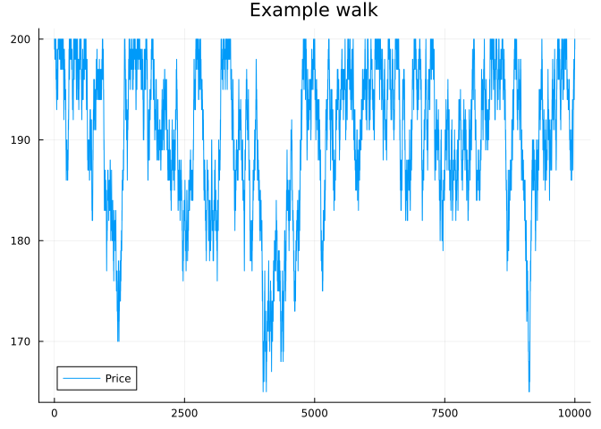
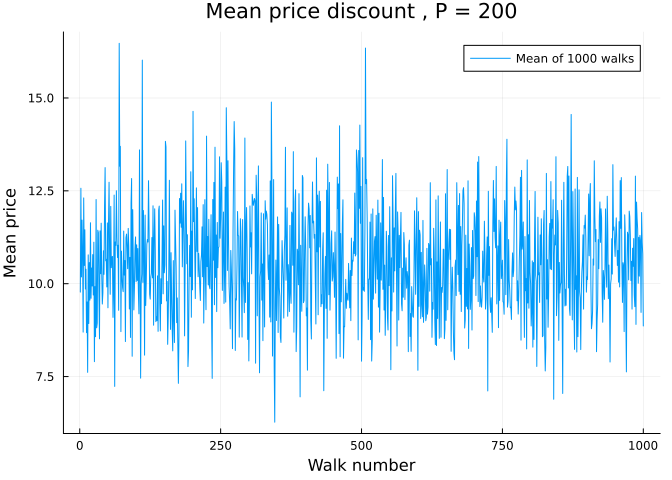
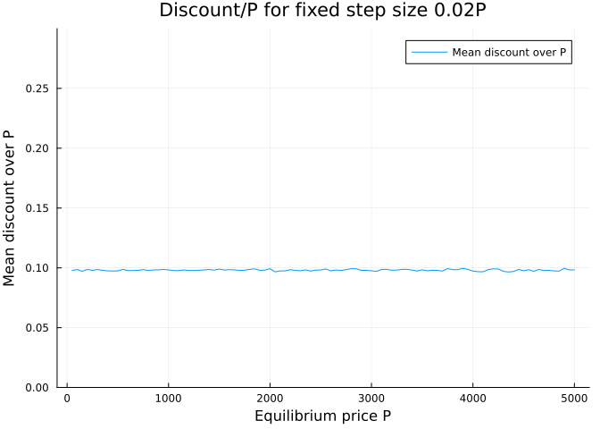
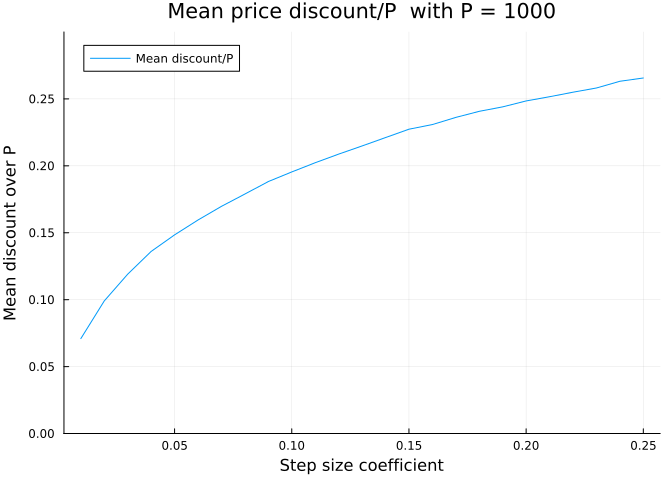
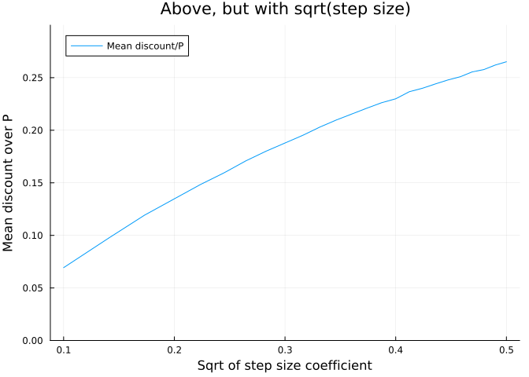
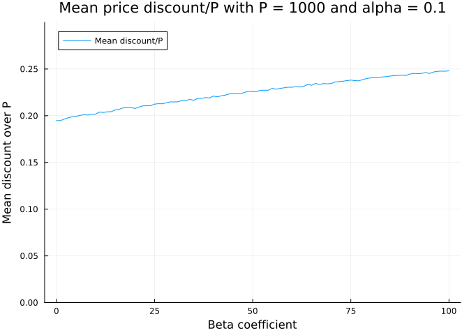

---
execute:
  echo: true
jupyter: julia-1.10
title: "Balmung: Access and pricing"
toc-title: Table of contents
---

## Why are prices so low on Balmung?

Sometimes, I play the video game Final Fantasy XIV with friends. Final
Fantasy is an MMO with a fairly active economy selling in-game items for
in-game currency, the *marketboard*.

Players of Final Fantasy XIV are split into servers, each with its own
marketboard. You can only *sell* on the marketboard of the server you
are based on, but usually *buying* on the marketboard of another server
is only a minor inconvenience. So there's usually not much difference in
pricing from server-to-server: players would rather spend a little bit
of time traveling to another server rather than eating a hefty
convenience fee.

But there's one major exception: the Balmung server. Balmung is so
active and so overpopulated that travel to it is almost always disabled.
So players based on Balmung can buy anywhere, but sellers on Balmung
have a much more restricted audience of only Balmung-based players.

And prices on Balmung are often *much* lower than on any other server.

Intuitively, it seems like these facts should be related: a smaller pool
of potential buyers artifically reduces demand, therefore reduces
prices. But what is the actual mechanism that drives prices down on
Balmung? Certainly players aren't doing supply/demand calculations in
their head when they set prices for the virtual items they are selling.

This post is an attempt to investigate.

<div>

> **tl;dr! Click me to see a solution summary**
>
> Prices everywhere move with a random walk. If the price on Balmung is
> higher than on other servers, buyers can simply leave Balmung and buy
> elsewhere. But if the price on Balmung is lower than elsewhere,
> sellers have no recourse. So prices on Balmung move in a one-sided
> random walk that is always below the equilibrium price.

</div>

## Is it one-sided price drift?

No item sold on the marketboard is priced using sophisticated theory.
Most items, it seems, are priced using the following algorithm:

1.  Look at the currently listed prices for the item you're selling
2.  Price your item one gil (one dollar) less than the cheapest
    competitor.

Let $b(P)$ be the chance that a player wants to buy our item at price
$P$, and $s(P)$ the chance that they want to sell our item at price $P$.

The equilibrium price, $P_{eq}$, has to satisfy $$
s(P_{eq}) = b(P_{eq})
$$

If demand and supply are both high, the equilibrium price should be
reached with minimal randomness: $$
P_{actual} = P_{eq} + \epsilon
$$

But what happens if demand is not that high? Then the actual price
should drift around the equilibrium price appreciably as, by random
chance, there is higher supply one day and higher demand the next:

$$
P_{actual} = P_{eq} + \text{drift}
$$

OK, so what happens if "the rest of the servers" have high demand but
Balmung alone has low demand? You should expect one-sided drift in the
price.

If there are ever too many Balmung *buyers*,
$P_{Balmung} > P_{elsewhere}$, buyers can simply leave Balmung and buy
elsewhere.

But Balmung sellers have no such recourse. If
$P_{Balmung} < P_{elsewhere}$, they just have to accept $P_{Balmung}$.

Therefore, there is a sort of one-sided random walk occurring in
Balmung: prices can get up to $P_{eq}$, but never go above them.

**Hypothesis**. Prices are lower on Balmung because of one-sided drift.

### Modeling the effect of drift

Let's assume that we never go too far from equilibrium, so the arrival
rates of sellers and buyers are both the equilibrium rate.

So our basic model for the drift is that buyers and sellers arrive with
a rate $R_{eq}$ *unless* $P_{Balmung} \geq P_{eq}$, in which case buyers
arrive with rate 0 and sellers arrive with the same rate, $R_{eq}$.

This process is very close to a random walk. Because we have set the
sell/buy rates to be equal, this random variable is actually $|X|$,
where $X$ is a random variable representing a random walk. So for larger
times $T$, drift is described by a *folded normal distribution*,
$\frac{Drift_T}{\sqrt{T}} \sim FoldN(0, \sigma)$.

The mean of the folded normal distribution is nonzero:

$$
\mathbb{E}[FoldN(0,\sigma)] = \sigma \sqrt{\frac{2}{\pi}} 
$$

So in our simple model, average drift should grow unbounded with time,
$$
\mathbb{E}[Drift_T] \sim \sigma \sqrt{\frac{2 T}{\pi}}
$$

Which means that this simple model can't be valid for large enough
times.

### Adding seller reluctance

As price goes lower, the amount of sellers will reduce. Since Final
Fantasy players are just having fun, they're far from rational market
agents and so the exact way in which their selling reduces will likely
be very complicated.

Let's choose a very simple model, where the rate of selling at price $P$
is just $$
R_P = R_{eq} \times \frac{P}{P_{eq} }
$$ this has the pleasant features of being 0 at price 0 and $R_{eq}$ at
$P = P_{eq}$.

At this point, our model is complicated enough that we should just write
it in code. A closed-form solution exists for our choice of $R_P$, but
after all we might want to choose another $R_P$ and so simulating seems
like an efficient way forward.

:::: {.cell execution_count="1"}
``` {.julia .cell-code}
function walled_biased_walk(time, eqprice, stepsize=1)
    function step_fn(w_prev, _)
        r = rand() < w_prev/(eqprice + w_prev) ? -1 : 1
        w_new = min(max(w_prev + r*stepsize, 0), eqprice)
        return w_new
    end
    walk = accumulate(step_fn, 1:time-1; init=eqprice)
    return walk 
end

using Plots 
plot(walled_biased_walk(10000,200),title = "Example walk", label = "Price")
```

::: {.cell-output .cell-output-display execution_count="2"}

:::
::::

Now we just need to calculate the expected value of this process.

:::: {.cell execution_count="2"}
``` {.julia .cell-code}
using Statistics  
function walled_biased_walk_mean(time, eqprice, stepsize=1)
    W = walled_biased_walk(time, eqprice, stepsize)
    return mean(W)
end

means = [200 - walled_biased_walk_mean(10000, 200) for _ in 1:1000]  # initialize with one walk
using Plots
plot(means, label="Mean of 1000 walks", xlabel="Walk number", ylabel="Mean price", title="Mean price discount , P = 200")
```

::: {.cell-output .cell-output-display execution_count="3"}

:::
::::

### Model parameters

What choices can we make in this model? Given our assumptions, there are
two real parameters left in the model:

1.  The choice of $R_P$

2.  The step size $s$, also possibly a function of $P$, $s(P)$.

Both these parameters can be quite general functions (under some
constraints, e.g. $R_P(0) = 0$ and $R_P(P_{eq}) = R_{eq}$).

But let's make an assumption of linearity, assuming
$R_P = R_{eq} \frac{P}{P_{eq}}$ and $s(P) = \alpha P_{eq} + \beta$ for
some constants $\alpha$ and $\beta$.

A constant step size $(\alpha = 0, \beta \neq 0)$ will lead to a
constant discount despite the size of $P$, which seems unrealistic: the
amount of drift should scale with the price of the item -- sellers are
willing to drop the price 100 gil (dollars) on a 100 000 gil item if
they're worried about selling it, but not if iti's a 100 gil item.

So we must have $\alpha > 0$.

So to start with basic modeling, let's choose a step size that is a
fraction of $P_{eq}$, say $s = \alpha P_{eq}$ and think about $\beta$
later.

:::: {.cell execution_count="3"}
``` {.julia .cell-code}
using Plots 
using Statistics
function avg_discount(time, eqprice, stepsize = 1, nwalks = 1000)
    means = [eqprice - walled_biased_walk_mean(time, eqprice, stepsize) for _ in 1:nwalks]
    return mean(means)/eqprice
end
discounts = Float64[]
for p in 50:50:5000
    push!(discounts, avg_discount(1000, p,0.02*p))
end
plot(50:50:5000,discounts, 
     title = "Discount/P for fixed step size 0.02P",
     xlabel = "Equilibrium price P", 
     label = "Mean discount over P",
     ylabel = "Mean discount over P"
     ,ylims = (0,0.3))
```

::: {.cell-output .cell-output-display execution_count="4"}

:::
::::

It's very motivating to see that the mean fractional discount in our
model is relatively constant over a wide range of prices. Now, what
about if we vary the step size?

:::: {.cell execution_count="4"}
``` {.julia .cell-code}
using Plots 
using Statistics
function avg_discount(time, eqprice, stepsize = 1, nwalks = 1000)
    means = [eqprice - walled_biased_walk_mean(time, eqprice, stepsize) for _ in 1:nwalks]
    return mean(means)/eqprice
end
discounts = Float64[]
for s in 0.01:0.01:0.25
    push!(discounts, avg_discount(1000, 1000, s*1000))
end
plot(0.01:0.01:0.25,discounts,
     ylims = (0,0.3),
     xlabel = "Step size coefficient",
        ylabel = "Mean discount over P",
        label = "Mean discount/P",
        title = "Mean price discount/P  with P = 1000")
```

::: {.cell-output .cell-output-display execution_count="5"}

:::
::::

The dependence seems roughly proportional to $\sqrt{\text{step size}}$:

:::: {.cell execution_count="5"}
::: {.cell-output .cell-output-display execution_count="6"}

:::
::::

Finally, let's look at the effect of $\beta$ for fixed $\alpha = 0.1$:

:::: {.cell execution_count="6"}
``` {.julia .cell-code}
discounts = Float64[]
for beta in 0:1:100
    push!(discounts, avg_discount(1000, 1000, 0.1*1000 + beta))
end 
plot(0:1:100, discounts,
     ylims = (0,0.3),
     xlabel = "Beta coefficient",
        ylabel = "Mean discount over P",
        label = "Mean discount/P",
        title = "Mean price discount/P with P = 1000 and alpha = 0.1")
```

::: {.cell-output .cell-output-display execution_count="7"}

:::
::::

So $\beta$ has a small, linear effect on mean discount.

## Does my model match the data?

Not every commodity will have the 'Balmung discount' effect as I've
modelled it, because the model as presented above is pretty simplistic.
For example, it assumes the price on every other server remains exactly
at equilibrium, which is only a reasonable approximation for highly
traded items. While a Balmung discount might exist for items traded less
frequently, modeling it would require adding in the assumption that
$P_{eq}$ itself can do a random walk (a fun problem, and possibly a
future post!)

To start, let's look at the data for a bucket of randomly chosen
commodities.

:::: {.cell execution_count="7"}
``` {.julia .cell-code}
using HTTP
using JSON
using DataFrames
ids = [44106,44347,13114, 13115, 47915,41763,41771]
discounts = Float64[]
worldV = Float64[]
dcV = Float64[]
for id in ids
    url = "https://universalis.app/api/v2/aggregated/Balmung/$id"
    response = HTTP.get(url)
    data = JSON.parse(String(response.body))
    avg_sale_price_world = data["results"][1]["nq"]["averageSalePrice"]["world"]["price"]
    avg_sale_price_dc = data["results"][1]["nq"]["averageSalePrice"]["dc"]["price"]
    daily_velocity_world = data["results"][1]["nq"]["dailySaleVelocity"]["world"]["quantity"]
    daily_velocity_dc = data["results"][1]["nq"]["dailySaleVelocity"]["dc"]["quantity"]
    balmung_discount = (avg_sale_price_dc - avg_sale_price_world) / avg_sale_price_world
    push!(discounts, balmung_discount)
    push!(worldV, daily_velocity_world)
    push!(dcV, daily_velocity_dc)
end
df = DataFrame(ID=ids, Discount=discounts, WorldVelocity=worldV, DCVelocity=dcV)
println(df)
```

::: {.cell-output .cell-output-stdout}
    7×4 DataFrame
     Row │ ID     Discount     WorldVelocity  DCVelocity  
         │ Int64  Float64      Float64        Float64     
    ─────┼────────────────────────────────────────────────
       1 │ 44106   0.287494       1328.25     13597.8
       2 │ 44347  -0.471662          0.31275    296.175
       3 │ 13114   0.0322932        40.3448     434.723
       4 │ 13115   0.165323         61.6117     320.881
       5 │ 47915  -0.00829986        1.251        7.81874
       6 │ 41763   0.522656        230.496     3361.43
       7 │ 41771   0.255139        220.175     1833.96
:::
::::

The above table shows the discount for each commodity, as well as the
average number of daily units sold on Balmung (WorldVelocity) and the
average number of daily units sold on all other servers (DCVelocity).

This bucket is very encouraging. All three highly sold commodities have
a consistent discount of about $25%$. It's commodities like these that
we claimed to model anyhow. (With a more complicated model, we might
expect to be able to model the smaller discount of the moderately sold
commodity 13115, but the very rarely sold commodities are likely not
governed by a random walk at all.)

## Appendix: A predictive model, and the perils of limited data

OK, so I purport to have a model explaining the Balmung discount, but
the real test of any model is whether it can predict unknown data. Our
simple model has some parameters (that a more principled model might be
able to partially predict, but for now we will just learn them from the
data). We'd like to learn them by fitting our model to some data, then
use the learned parameters to predict the discount for a new commodity.

One issue is that the Final Fantasy market is not *that* large; there
are not so many commodities traded in sufficient volume to help us fit
our model. Further, the API to access marketboard data is heavily
rate-limited, so collecting large amounts of data is time-consuming. So
let's restrict ourselves to learning limited parameters and hoping our
loss is not too large.

So let's restrict ourselves to learning limited parameters with limited
data. There are three things we could learn from the data that seem
useful:

1.  The step size $step(P_{eq}, wV, dcV)$, which is a function of the
    equilibrium price and the velocities on both servers.
2.  The minimum $(wV, dcV)$ at which our model applies.
3.  The function $R_P(P, P_{eq}, wV,dcV)$.

The function $R_P$, I claim, is commodity-specific. The reason is that
commodities are produced for different reasons. For a real life example,
think about chicken wings. Chickens are raised primarily for breast
meat, and wings are a byproduct. So, for chicken wings, supply shouldn't
vary much with the price of wings: it mostly depends on the price of
breast meat.

Therefore, learning a 'universal' $R_P$ won't do us much good, and so
our simple linear model seems like a reasonably good choice at our
current level of sophistication.

So we will instead focus on 1), 2). Again, let's choose something very
harsh and set an arbitrary binary threshold for velocities and just
learn 1), leaving dealing with 2) to a future post where we deal with a
more sophisticated model which incorporates the velocities directly.
Then we just need to learn 1).

### Collecting training data

Collecting data is a little tricky, since the API is *heavily*
rate-limited and doesn't natively provide a way to get commodities by
velocity.

I tried uniformly sampling market data, but the API is very slow and
most of the items I sampled had too low velocity to be modeled. Instead,
we sample from the most recently updated items on the marketboard.

:::: {.cell execution_count="8"}
``` {.julia .cell-code}
using HTTP, JSON, StatsBase

# uniformly sample market data 
function collect_market_data(item_ids, batch_size=100, num_samples=1000, world="Balmung", min_velocity=100, min_price = 500)
    # Sample item IDs
    sample_ids = StatsBase.sample(item_ids, num_samples, replace=false)
    # Collect columns as vectors
    cols = Vector{Vector{Float64}}()

    # Batch request
    for batch in Iterators.partition(sample_ids, batch_size)
        id_str = join(batch, ",")
        url = "https://universalis.app/api/v2/aggregated/$world/$id_str"
        response = HTTP.get(url)
        data = JSON.parse(String(response.body))
        # The response has a "results" array
        for item in data["results"]
            try
                avg_sale_price_world = item["nq"]["averageSalePrice"]["world"]["price"]
                avg_sale_price_dc = item["nq"]["averageSalePrice"]["dc"]["price"]
                daily_velocity_world = item["nq"]["dailySaleVelocity"]["world"]["quantity"]
                daily_velocity_dc = item["nq"]["dailySaleVelocity"]["dc"]["quantity"]
                # if the velocities are too low, skip this item
                # if the price is too low, skip this item
                if (daily_velocity_world < min_velocity) || (avg_sale_price_dc < min_price) 
                    continue
                end
                push!(cols, [avg_sale_price_world, avg_sale_price_dc, daily_velocity_world, daily_velocity_dc])
            catch
                continue  # skip items with any missing data
            end
        end
    end

    # Convert collected columns to a matrix
    return hcat(cols...)  # 4 x N matrix
end 

# sample from the most recent market data 
worldList = ["Balmung", "Mateus", "Gilgamesh", "Zalera", "Exodus", "Sargatanas", "Jenova","Cactuar", "Leviathan", "Ultros", "Adamantoise", "Faerie", "Midgardsormr", "Coeurl", "Diabolos"]
function collect_recent_market_data(min_velocity=100, entries=200, minprice = 300,worlds = worldList)
    all_items = []
    for world in worlds
        url = "https://universalis.app/api/v2/extra/stats/most-recently-updated?world=$world&entries=$entries"
        response = HTTP.get(url)
        item_ids = map(item -> item["itemID"], JSON.parse(String(response.body))["items"])
        append!(all_items, item_ids)
    end
    num_ids = length(all_items)
    return collect_market_data(all_items, 100, min(num_ids,1000), "Balmung", min_velocity, minprice)
end
```

::: {.cell-output .cell-output-display execution_count="9"}
    collect_recent_market_data (generic function with 5 methods)
:::
::::

### Modeling the step size

Our model predicts a discount, so our loss function will be the mean
squared error between the predicted fractional discount and the observed
fractional discount.

Now we need to fit the step size function. One approach would be to use
a simple neural network to incorporate the price and velocity as
features.

First, let's collect some training data from the market and save it.

::::: {.cell execution_count="9"}
``` {.julia .cell-code}
using CSV
using DataFrames
url = "https://universalis.app/api/v2/marketable"
response = HTTP.get(url)
item_ids = JSON.parse(String(response.body))
if !isfile("data.csv")
    println("Collecting training data...")
    data_matrix = collect_recent_market_data(600,200,400,worldList)
    CSV.write("data.csv", DataFrame(data_matrix,:auto))
else
    println("Training data already exists, skipping collection.")
    data_matrix = Matrix(CSV.read("data.csv", DataFrame))
end
```

::: {.cell-output .cell-output-stdout}
    Training data already exists, skipping collection.
:::

::: {.cell-output .cell-output-display execution_count="10"}
    4×3 Matrix{Float64}:
      395.853  9038.65   1114.93
      460.044  9572.72   1119.71
      622.748   615.168   761.288
     5508.78   3659.45   7620.46
:::
:::::

Train a neural network:

::::: {.cell execution_count="10"}
``` {.julia .cell-code}
using Flux, HTTP, JSON, CSV

# Load the training data
data_matrix = CSV.read("data.csv", DataFrame)
# Convert to a matrix for processing
data_matrix = Matrix(data_matrix)

# Define a simple neural network for step size prediction
function step_size_model()
    return Chain(
        Dense(3, 4, relu),  # Input layer: 3 features (dcPrice, worldVelocity, dcVelocity)
        Dense(4, 4, relu),  # Hidden layer
        Dense(4, 1)          # Output layer: step size
    )
end
# Create the model
function loss(model, X, Y)
    preds = [avg_discount(1000,X[2, i], only(model(X[:, i])),20) for i in 1:size(X, 2)]
    return sum((preds .- Y).^2)
end
model = step_size_model()
# Define the optimizer
optimizer = Flux.setup(Adam(), model)
# Prepare the training data
X_train = data_matrix[2:4, :]  # Features: dcPrice, worldVelocity, dcVelocity
Y_train = (data_matrix[1, :] .- data_matrix[2, :])./ (data_matrix[1, :]) # Target: fractional discount = (worldPrice - dcPrice) / dcPrice
# Reshape for Flux
X_train = reshape(X_train, size(X_train, 1), size(X_train, 2))
Y_train = reshape(Y_train, size(Y_train, 1), size(Y_train, 2))
# Training loop
epochs = 600
for epoch in 1:epochs
    Flux.train!(loss, model,[(X_train, Y_train)], optimizer)
    if epoch % 100 == 0
        println("Epoch $epoch: Loss = $(loss(model, X_train, Y_train))")
    end
end
```

::: {.cell-output .cell-output-stderr}
    ┌ Warning: Layer with Float32 parameters got Float64 input.
    │   The input will be converted, but any earlier layers may be very slow.
    │   layer = Dense(3 => 4, relu)  # 16 parameters
    │   summary(x) = "3-element Vector{Float64}"
    └ @ Flux ~/.julia/packages/Flux/9PibT/src/layers/stateless.jl:60
:::

::: {.cell-output .cell-output-stdout}
    Epoch 100: Loss = 2.5114821627859127
    Epoch 200: Loss = 2.5099059050645067
    Epoch 300: Loss = 2.5075725127222377
    Epoch 400: Loss = 2.5064704837422305
    Epoch 500: Loss = 2.5088357315925185
    Epoch 600: Loss = 2.50637496068893
:::
:::::

### So how good is our model?

Let's look at the results.

:::: {.cell execution_count="11"}
``` {.julia .cell-code}
using DataFrames
# make a table of prediced vs actual discounts
X = X_train 
preds = [avg_discount(1000, X[2, i], only(model(X[:, i])), 100) for i in 1:size(X, 2)]
actual_discounts = (data_matrix[2, :] .- data_matrix[1, :])./data_matrix[2, :] # actual fractional discounts
df_results = DataFrame(
    BalmungPrice = data_matrix[1, :],
    RestPrice = data_matrix[2, :],
    PredictedDiscount = preds,
    ActualDiscount = actual_discounts,
    DiscountError = preds .- actual_discounts,
    StepSize = [only(model(X[:, i])) for i in 1:size(X, 2)],
    WorldVelocity = data_matrix[3, :],
    DCVelocity = data_matrix[4, :]
)
```

::: {.cell-output .cell-output-display .cell-output-markdown execution_count="12"}
\begin{tabular}{r|ccccccc}
    & BalmungPrice & RestPrice & PredictedDiscount & ActualDiscount & DiscountError & StepSize & \\
    \hline
    & Float64 & Float64 & Float64 & Float64 & Float64 & Float32 & \\
    \hline
    1 & 395.853 & 460.044 & 0.999069 & 0.139533 & 0.859536 & -1803.88 & $\dots$ \\
    2 & 9038.65 & 9572.72 & 0.331962 & 0.0557899 & 0.276172 & 1628.94 & $\dots$ \\
    3 & 1114.93 & 1119.71 & 0.999249 & 0.00426952 & 0.99498 & -2345.28 & $\dots$ \\
\end{tabular}
:::
::::

So the neural network approach didn't work very well. The core issue is
that it turns out there are *very few* commodities which have sufficient
velocity to be modeled. While I allowed the data to include
intermediate-velocity examples, it's clear our model doesn't work for
them. While those very few high-velocity commodities are the ones you
keep seeing as a player, they are actually very sparse.

For those, we have few enough examples that the empirical table above
shows $\alpha \approx 0.25$. We could leave satisfied with that, or we
could try to develop a more sophisticated model that can handle
intermediate-velocity commodities. As a consequence, we would have
enough data to fit parameters numerically.
